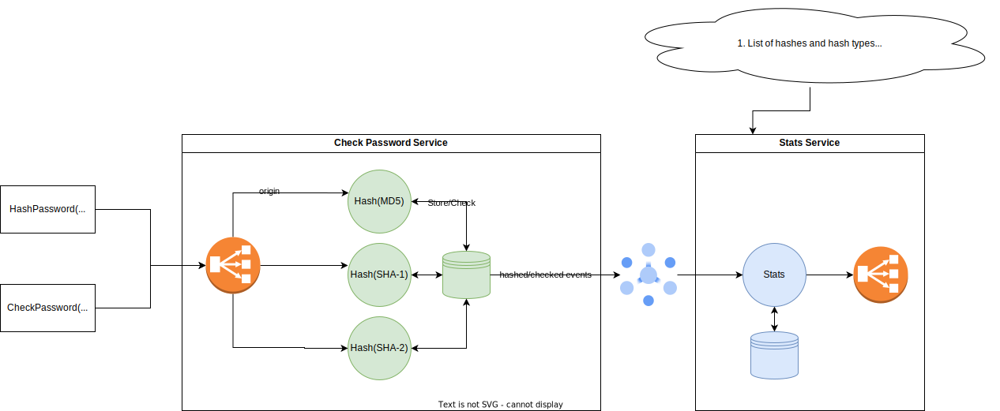

# VSS bootstrap

The goal of this project is to enable jumpstarting a new typical Scala project with the choice of different flavors:
* Scala Vanilla - as simple as possible, pure scala setup,
* ZIO - native stack for ZIO framework,
* cats - native stack for cats-effect toolkit. 

VSS bootstrap enables generating full non-trivial scala backend app together with the infrastructure layer. Everything is ready to be deployed with one command.

## Why did we create VSS bootstrap?

Scala has many great libraries and it is not a trivial task to find the best subset for your project. The same problem is also visible with many ways of providing an infrastructure layer. 
These two things together generate unnecessary traction, harm time to market, and cause problems with maintaining the solution (wrong set of libraries, multiple ways to do the same thing).
VSS bootstrap enables jump-start the new project and building quickly valuable complete solution, solution easy to maintain in the long run.

## VSS assumptions

Assumptions:
* bootstrap should only focus on scala-based backend part,
* architecture should be simple but not oversimplified, with a typical use case for Scala language,
* the source code should be easily understandable,
* bootstrap should enforce an opinionated library set, optimal for each flavor,
* the architecture layer should be set up out of the box,
* we will use only prod-ready solutions (or in the worst-case scenario - solutions that are the closest to be prod ready in a given ecosystem).

## VSS bootstrap architecture example

What examplary problem VSS bootstrap solves?
The goal of the system is to check password security and return the information if the given password (or password hash) is safe to be used. For each check request we will try to crack the password or check it against common known leaks.
The system can be fed with a stream of plain text password combinations that should be forbidden to use (treated as easy to crack). 




## Technology and functionalities

Check Password Service:
* HTTP/gRPC endpoints
* Storing forbidden combinations in database
* Caching layer for recently cracked/used password
* Pub/Sub solution for sending events about checked passwords


Stats Service:
* Read check results events from Pub/Sub
* Displaying current system stats and browsing the historical checks


## Solution

### Run VSS demo app:

VSS Vanilla
```
$ sbt "vss_vanilla/runMain com.virtuslab.vss.vanilla.mainVanilla"
```

VSS ZIO
```
$ sbt "vss_zio/runMain com.virtuslab.vss.zio.MainZIO"
```

### Use it:

HTTP docs:
```
http://localhost:8080/docs/
```

HTTP request example:
```bash
curl -X 'POST' \
  'http://localhost:8080/hash' \
  -H 'accept: application/json' \
  -H 'Content-Type: application/json' \
  -d '{
  "hashType": "MD5",
  "password": "some_password"
}'
```

gRPC request example:

```bash
grpcurl -d '{"hashType": "MD5", "password": "somepassword"}' --import-path vss-vanilla/src/main/protobuf --proto password.proto --plaintext localhost:8181 com.virtuslab.vss.proto.HashPasswordService/HashPassword
```

